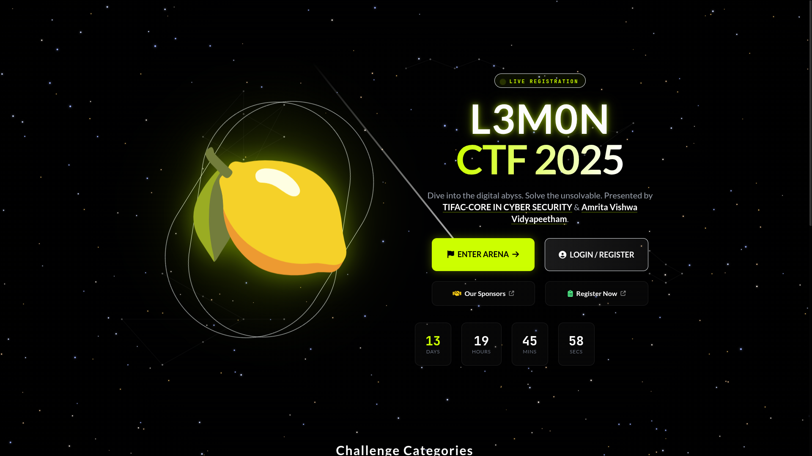
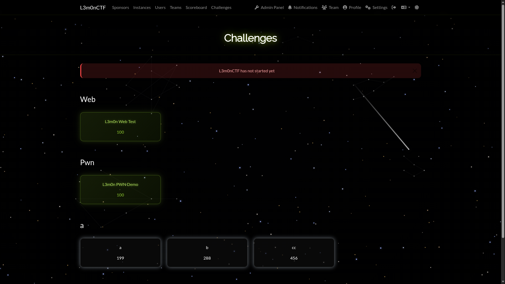
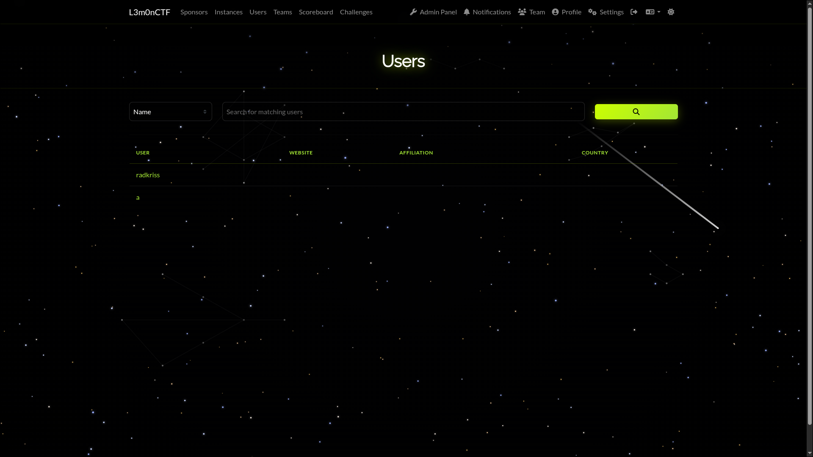
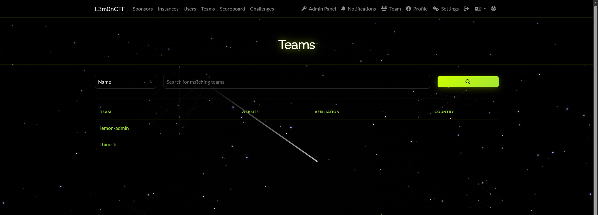
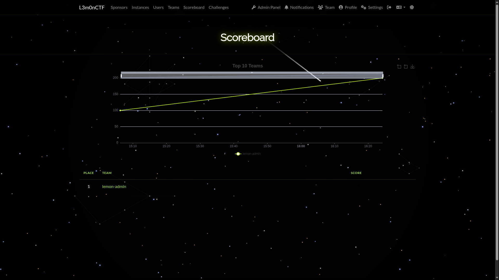

# Stargaze Theme 🍋

A premium, glass-morphism dark theme for CTFd with vibrant lemon/lime accents. Features a stunning Tailwind CSS homepage and custom-styled components.

## 📸 Showcase

| | |
|:-------------------------:|:-------------------------:|
| **Homepage** <br>  | **Challenges** <br>  |
| **User Profile** <br>  | **Teams List** <br>  |
| **Team Profile** <br>  | **Scoreboard** <br>  |

## ✨ Features

- **Glass-morphism Design**: Frosted glass panels, transparent tables, and deep space backdrops.
- **Dynamic Star Field**: Interactive canvas background with glowing stars and shooting stars that react to user presence.
- **Tailwind Homepage**: A completely custom homepage built with Tailwind CSS (served via CDN).
- **Responsive**: Fully mobile-optimized layout.

## 📦 Installation

1.  Copy the `stargaze` folder into your CTFd `themes` directory:
    ```bash
    cp -r stargaze /path/to/CTFd/themes/
    ```
2.  Log in to your CTFd Admin Panel.
3.  Go to **Config** > **Themes**.
4.  Select **stargaze** and click **Update**.

## 🛠️ Customization

### Homepage
The homepage (`templates/index.html`) uses Tailwind CSS via CDN. You can edit the structure directly in that file. It automatically pulls your CTF name and start time from the CTFd Config.

### Colors
Core theme colors are defined in `assets/scss/main.scss` and `templates/base.html` (CSS Variables).

```css
:root {
  --lemon: #ccff00;
  --lemon-dim: #a3e635;
  --lemon-glow: rgba(204, 255, 0, 0.5);
}
```
