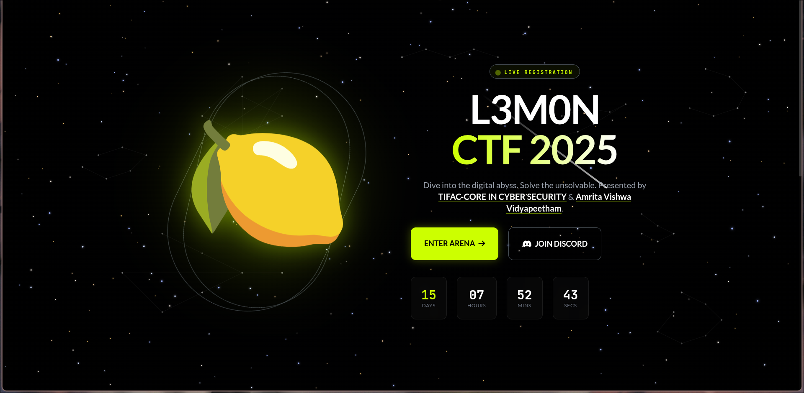
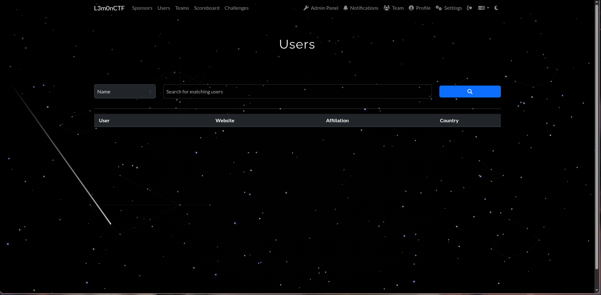

# 🌌 Stargaze — A Space-Themed CTFd Theme

**Transform your CTF platform into an immersive cosmic experience**

*A modern, space-themed CTFd theme featuring an interactive starfield background, realistic constellations, and shooting stars.*

---

## ✨ Features

### 🎨 Visual Effects
- **Dynamic Starfield** — 300+ stars with realistic stellar classification colors (O/B blue-white to M-class red)
- **Twinkling Animation** — Subtle, randomized star twinkling for an authentic night sky feel
- **Shooting Stars** — Occasional meteor showers with smooth trails and gradual fade
- **8 Constellations** — Orion, Ursa Major, Cassiopeia, Cygnus, Lyra, Scorpius, Leo, and Corona Borealis
- **Parallax Effect** — Subtle star movement in response to mouse position
- **Nebula Glow** — Soft radial gradients adding cosmic depth

### 🖥️ UI Enhancements
- **Glassmorphism Design** — Semi-transparent panels with backdrop blur
- **Custom Cursors** — Space-themed crosshair cursor with glow effects
- **Dark Theme Optimized** — Fully designed for dark mode viewing
- **Responsive Layout** — Works seamlessly on desktop and mobile devices

### ⚡ Performance
- **Canvas-based Rendering** — Hardware-accelerated animations
- **Lazy Shooting Stars** — Spawns only when page is visible and focused

---

## 📸 Preview

---

⭐ **If you find this theme useful, consider giving it a star!** ⭐

